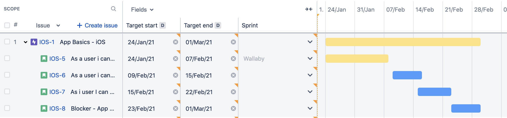
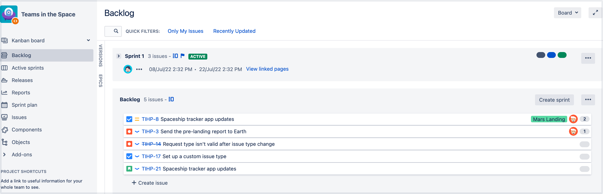
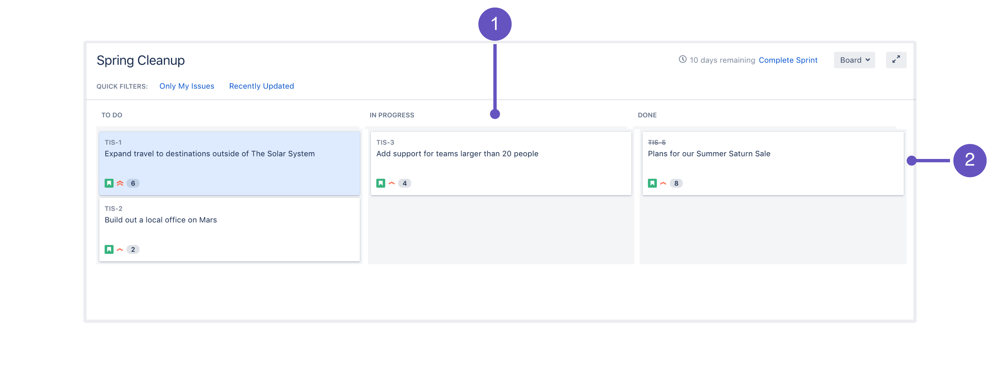
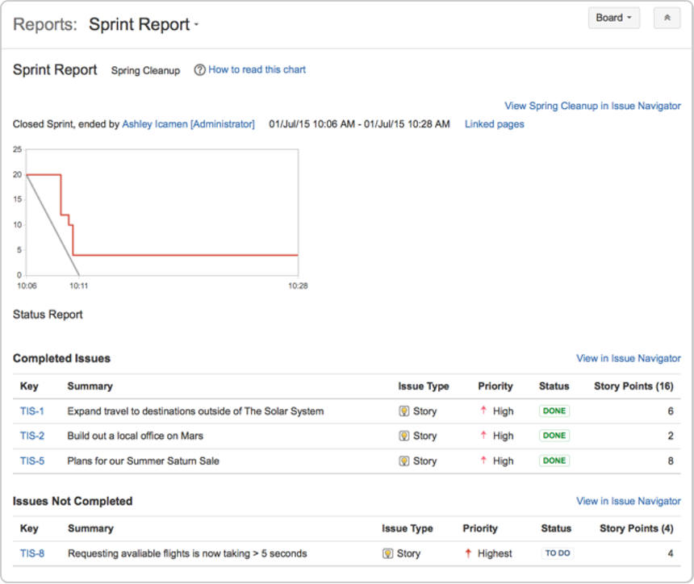
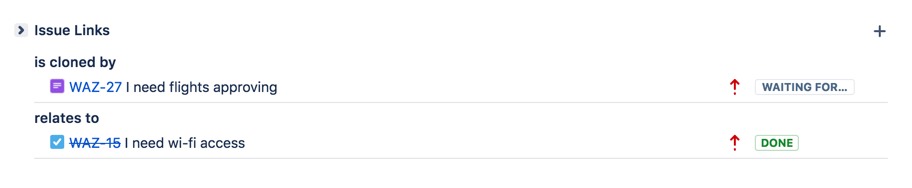
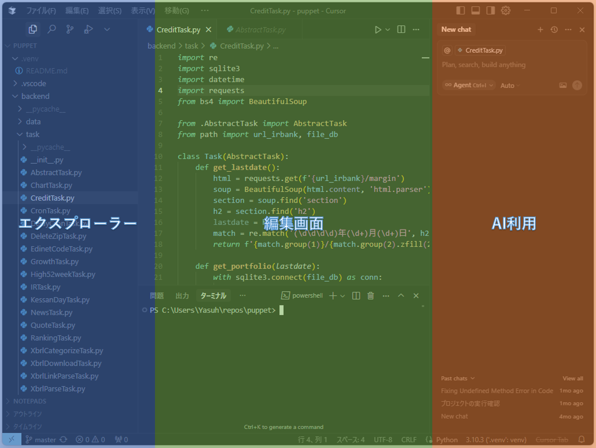

# 使用する主なツール

Sonic Scaleでは、以下のツールを組み合わせて使用します。

- **JIRA:** タスク管理、進捗管理
- **GitHub:** ソースコード管理、CI/CD
- **Cursor:** ドキュメント作成、編集

これらのツールは広く利用されており、多くの開発者が既に利用経験をお持ちかと思います。
ここでは、各ツールの詳細な説明は割愛し、Sonic Scaleにおける各ツールの活用方法についてポイントを絞って解説します。

## プロセスとツールの関係
プロセス観点で各ツールの位置づけを説明すると、以下のようになります。

- **JIRA:** プロセスの実行を計画、進捗管理するツール
- **GitHub:** プロセスの成果物を管理、共有するツール
- **Cursor:** プロセスを実行するツール

## JIRA

参照：[JIRA](https://www.atlassian.com/software/jira)

JIRAは、タスク管理と進捗管理に利用します。
JIRAのチケットをプロセスを実行する各作業に対応させ、
担当者、ステータス、期日などを管理します。
また、JIRAのレポート機能を利用して、プロジェクト全体の進捗状況を可視化します。

## JIRAプロジェクト

Sonic Scaleでは6つのJIRAプロジェクトを作成します
- システム要求管理
- 要求仕様書管理
- 設計・開発
- テスト管理
- 不具合管理
- 運用課題・技術課題

## JIRAの作業タイプ

Sonic Scaleで設定するJIRAの作業タイプは以下になります。

- 長期テーマ
- システム要求
- 要求仕様
- テスト仕様
- 設計仕様
- 実装
- テスト実行
- バグ
- 運用課題
- 技術課題
- Q&A
- タスク
- サブタスク

### エピックとストーリー

JIRAで初めてプロジェクトを作成すると、エピック、ストーリー、タスク
という3種類の作業タイプがデフォルトで用意されています。
このうち、エピックとストーリーはJIRAの運用の中でも重要な意味を持ちますが、
言葉の意味が広く浸透した概念ではないため、Sonic Scaleではエピックを長期テーマ、ストーリーをシステム要求という言葉に置き換えて運用します。

## JIRAプロジェクトと作業タイプ

JIRAプロジェクトと作業タイプの関連は以下のようになります

<table>
  <thead>
    <tr>
      <th>JIRAプロジェクト</th>
      <th>作業タイプ</th>
      <th>説明</th>
    </tr>
  </thead>
  <tbody>
    <tr>
      <td>システム要求管理</td>
      <td>システム要求</td>
      <td>システム要求を管理します</td>
    </tr>
    <tr>
      <td>要求仕様書管理</td>
      <td>要求仕様</td>
      <td>システム要求を元に要求仕様書を作成する作業を管理します</td>
    </tr>
    <tr>
      <td rowspan=2>設計・開発</td>
      <td>設計仕様</td>
      <td>要求仕様書を元に設計仕様書を作成する作業を管理します</td>
    </tr>
    <tr>
      <td>実装</td>
      <td>設計仕様書に基づいてソフトウェアを実装する作業を管理します</td>
    </tr>
    <tr>
      <td rowspan=3>テスト管理</td>
      <td>テスト仕様</td>
      <td>要求仕様書を元にテスト仕様書とテストケースを作成する作業を管理します</td>
    </tr>
    <tr>
      <td>実装</td>
      <td>テストケースを自動実行するテストコードを実装する作業を管理します</td>
    </tr>
    <tr>
      <td>テスト実行</td>
      <td>テストケースに基づいてテストを実行する作業を管理します</td>
    </tr>
    <tr>
      <td>不具合管理</td>
      <td>バグ</td>
      <td>テスト実行時に発見されたバグを管理します</td>
    </tr>
    <tr>
      <td rowspan=2>運用課題・技術課題</td>
      <td>運用課題</td>
      <td>運用に関する課題を管理します</td>
    </tr>
    <tr>
      <td>技術課題</td>
      <td>技術的な課題を管理します</td>
    </tr>
    <tr>
      <td rowspan=4>共通</td>
      <td>長期テーマ</td>
      <td>プロジェクト全体の長期的なテーマを管理します</td>
    </tr>
    <tr>
      <td>Q&A</td>
      <td>仕様書に対する質問と回答を管理します</td>
    </tr>
    <tr>
      <td>タスク</td>
      <td>上記に当てはまらないその他の作業を管理します</td>
    </tr>
    <tr>
      <td>サブタスク</td>
      <td>作業を細分化したサブタスクを管理します</td>
    </tr>
  </tbody>
</table>

## ロードマップ

参照：[Advanced Roadmaps のプラン](https://ja.confluence.atlassian.com/jirasoftwareserver/plans-in-advanced-roadmaps-1044784166.html)

JIRAのロードマップ機能を使って長期テーマの実施時期を設定します

## スプリントプランニング

参照：[スプリントの計画](https://ja.confluence.atlassian.com/jirasoftwareserver/planning-your-sprint-938845103.html)

JIRAのバックログ機能を使ってスプリントプランニングを実行します

## 進捗管理

参照：[進捗状況のトラッキング](https://ja.confluence.atlassian.com/jirasoftwareserver/tracking-your-progress-938845110.html)

JIRAのアクティブ スプリント画面で各作業の進捗管理を行います

## スプリントレビュー

参照：[作業の完了](https://ja.confluence.atlassian.com/jirasoftwareserver/wrapping-up-your-work-938845132.html)

JIRAのスプリント レポート画面でスプリントレビューを実施します

## JIRAリンク

参照：[課題をリンクする](https://ja.confluence.atlassian.com/jirasoftwareserver/linking-issues-939938934.html)

JIRAのリンク機能を使って作業間の関連を管理します

## GitHub

参照：[GitHub](https://github.co.jp/)

GitHubは、仕様書、ソースコード、各ドキュメントの管理、CI/CDに利用します。

GitHubのリポジトリにドキュメントを格納し、
github flowに基づいたブランチ戦略で運用し、
プルリクエストによるレビュー・承認手続き、
タグ付与によるリリース手続きを行います。

また、GitHub Actionsを利用して、CI/CDパイプラインを構築し、
自動テスト、ビルド、デプロイなどを実行します。

### マークダウンプレビュー

### 履歴管理

### プルリクエスト

### タグ付け、リリース

## Cursor

参照：[Cursor](https://cursor.sh/)

CursorはVisual Studio Codeから派生したソースコードエディタであり、
統合開発環境です。

仕様書、ソースコード、各ドキュメントの作成、編集に利用します。

CursorにはAIの機能が組み込まれており、ドキュメントやソースコードの作成・編集を自動化することができます。

## JIRAとGitHubの連携

JIRAとGitHubは連携させて運用します。
JIRAのチケットからGitHubのブランチを作成し、
GitHubのプルリクエストによってJIRAのチケットを更新します。

この連携によって作業とその成果物を紐づけて管理することができます。
つまり、JIRAのチケットからドキュメントやソースコードの変更箇所を特定したり、
逆にドキュメントから関連するJIRAチケットを特定することできます。

## CursorとGitHubの連携

CursorはGit操作を標準でサポートしており、
GitHubリポジトリのクローン、編集、コミット、プッシュなどの作業を
Cursor内で完結させることができます。

## CursorとJIRAの連携

CursorとJIRAを連携するには、MCP（Model Context Protocol）という仕組みを利用します。
MCPは、Cursorの拡張機能として提供されており、
JIRAのチケット情報を取得したり、
CursorからJIRAのチケットを更新したりすることができます。
MCPの設定方法については、
[Model Context Protocol](https://docs.cursor.com/context/model-context-protocol)
を参照してください。

# その他のツール

## Confluence

参照：[Confluence](https://www.atlassian.com/software/confluence)

Confluenceは、ドキュメント作成、情報共有に利用します。
Sonic Scaleでは、仕様書はGitHubで管理するので、
それ以外の各種ドキュメント、議事録、ノウハウやTipsなどをConfluenceに集約します。
Confluenceのページを構造化し、検索性を高めることで、必要な情報に素早くアクセスできるようにします。
また、JIRAとの連携機能を利用して、JIRAのチケット情報をConfluenceのページに埋め込むことができます。

## Figma

参照：[Figma](https://www.figma.com/)

Figmaは、UI/UXデザイン、プロトタイピングに利用します。
WebサイトやアプリケーションのUIデザインを作成します。
Figmaの共同編集機能を利用して、デザイナー、エンジニア、プロダクトオーナーがリアルタイムでデザインをレビューし、フィードバックを共有します。
作成したデザインは、開発者が利用できるように共有します。

## Teams

参照：[Teams](https://www.microsoft.com/ja-jp/microsoft-teams/group-chat-software)

Teamsは、コミュニケーション、コラボレーションに利用します。
Teamsのチャット機能を利用して、チームメンバー間で迅速なコミュニケーションを行います。
Teamsのチャネルをプロジェクトやテーマごとに作成し、関連する情報を集約します。
また、Teamsのビデオ会議機能を利用して、リモートでの打ち合わせや会議を行います。
