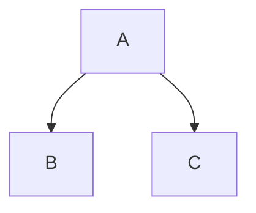
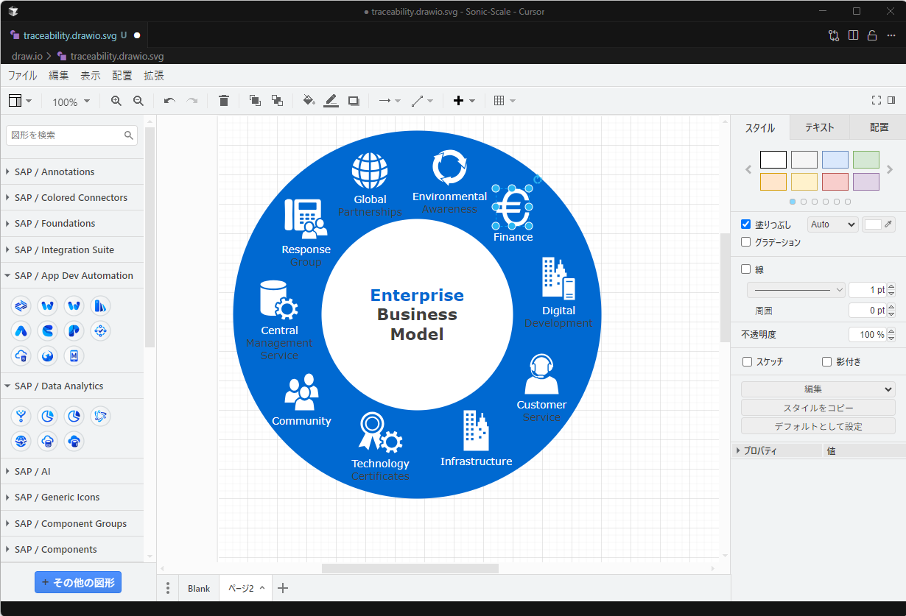

# マークダウン

Sonic Scaleでは、最終成果物のドキュメント作成にマークダウン形式を採用します。
要求仕様書、テスト仕様書、テストケース、設計仕様書...
ソースコードを除く全ての公式ドキュメントをマークダウン形式で記載し、githubで公開します。ワードやエクセルは使用しません。

フォーマットを強制することはドキュメント作成者にとっては制約になるかもしれませんが、それを補って余りあるメリットがあります。

## マークダウンとは

マークダウンは、軽量で記述が容易なマークアップ言語であり、テキストエディタで簡単に作成・編集できます。
また、draw.ioを組み合わせて、図やグラフを簡単に作成し、ドキュメントに埋め込むことができます。

## マークダウンを採用する理由

マークダウンを採用する理由を以下に列挙します。

- AIにとって読みやすく、書きやすいフォーマットである
- 人にとって読みやすく、書きやすいフォーマットである
- gitで管理することで、ドキュメントの変更点が明確になる
- githubで管理することでドキュメント内の各章へのリンクが生成される

### AIにとって読みやすく、書きやすいフォーマットである

マークダウンを採用する最大の理由がこれです。
マークダウンとAIは非常に相性が良いです。
マークダウンで記載されたドキュメントをAIにインプットすると、
そこに書かれた内容をAIは正しく理解することができます。
また、AIにマークダウン形式のアウトプットを依頼すると、品質の高いアウトプットを出力してくれます。

ちなみに、本ドキュメントもマークダウン形式で書かれており、その半分くらいはAIが書いています。

### 人にとって読みやすく、書きやすいフォーマットである

マークダウン記法はとてもシンプルです。AIだけでなく、人にとっても読みやすく、書きやすいフォーマットです。AIが作成したドキュメントを人が補足したり、その逆も簡単に行うことができます。

#### マークダウン記法

基本的なマークダウン記法を以下に示します。

- 見出し: `#`、`##`、`###` ...
- 段落: 空行で区切る
- 箇条書き: `-` または `*`
- 番号付きリスト: `1.`、`2.` ...
- 強調: `**太字**`、`*斜体*`
- リンク: `[リンクテキスト](URL)`
- 画像: ``
- コード: `` `コード` ``
- コードブロック: ` ```コード``` `

### gitで管理することで、ドキュメントの変更点が明確になる

wordやexcelはファイルの差分を比較するのが難しいフォーマットです。
マークダウンは、シンプルな記法のテキストファイルなので、gitで管理すれば、
バージョン毎に何が追加、削除、変更されたか一目瞭然です。
githubのプレビュー機能を使えば、プレビュー状態で差分を確認することもできます。

### githubで公開することでドキュメント内の見出しへのリンクが生成される

マークダウンをgithubで公開すると、各見出しにアンカーリンク（ページ内リンク）が張られます。これを利用して、「バージョン〇〇のドキュメント〇〇の〇章」をURLで一意に指定することができます。

URLは以下のような形式になります。

```
https://github.com/<<アカウント>>/<<リポジトリ>>/blob/<<タグ>>/<<フォルダー>>/<<マークダウンファイル名>>.md#<<見出し>>

例)
https://github.com/sonic-scale/requirement-spec/blob/v.1.0.0/general/general-rule.md#abstraction
```

このURLを別ドキュメントから参照させることで、ドキュメントとドキュメントを関連づけることができます。

マークダウンでは、例えば以下のように記載することで別ドキュメントへのリンクを張ります。

```
例)
# ログイン画面の画面設計仕様
参照：[ログイン画面の要求仕様](https://github.com/sonic-scale/requirement-spec/blob/v.1.0.0/screen/login-screen.md#details)
```

参照先のURLは必ずタグ名（バージョン名）を含むものにして下さい。
タグ名ではなくブランチ名で参照すると参照先が変更される可能性があります。


## マークダウンエディタ

Cursorのマークダウンエディタを使用します。
プレビュー機能を使用すると、編集中のドキュメントをリアルタイムで確認できます。


## mermaid記法

mermaid記法はマークダウン中に、テキストで記述することで、フローチャートやシーケンス図などの図を生成する記法です。
マークダウンのプレビュー画面上では図で表示されます。
これにより、手軽に図を作成し、ドキュメントに埋め込むことができます。
シンプルに表現可能な図はmermaid記法で記載し、複雑な図は、この後説明するdraw.ioを使って作図を行います。

以下にmermaid記法の例を示します。

#### 記法

~~~

~~~

#### 生成される図


# draw.io

## draw.ioエディタ

draw.ioは、Webブラウザ上で動作する無料の作図ツールですが、
cursorにプラグインをインストールすればcursor上で編集でき、
様々な図やグラフを簡単に作成できます。



## draw.ioの使い方

1. cursor上で「.drawio.svg」拡張子で新規ファイルを作成します
2. 作成したファイルをダブルクリックすると編集画面が表示されます
3. 図形やコネクタを配置し、テキストを追加します
4. 保存します

## マークダウンへの埋め込み

.drawio.svg形式で保存した図は直接マークダウンドキュメントに埋め込むことができます。