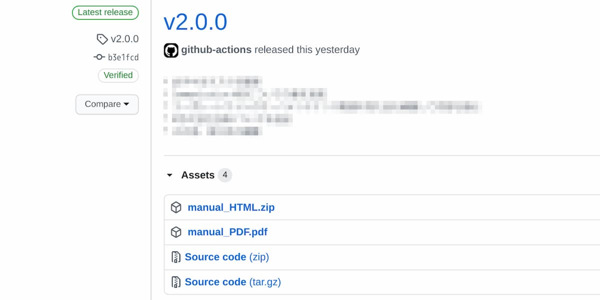

# GitHubフロー

参照：[GitHub フロー](https://docs.github.com/ja/get-started/using-github/github-flow)

GitHubフローは、ドキュメントやソースコードの変更を管理してリリースするためのシンプルなワークフローです。GitHubフローを採用する理由は、
mainブランチを常にステーブルな状態に保ちつつ更新を続けることです。
各ドキュメントの変更はmainブランチから分岐したブランチで作業を行い、
プルリクエストによるレビュー・承認手続きを経て
mainブランチにマージします。
Sonic Scaleでは各仕様書やソースコードをGitHubで管理し、
GitHubフローに従った運用を行います。

## GitHub フローの詳細

1. **main ブランチは常にリリース可能な状態を保つ**
   
    テストが失敗するなど致命的な問題があれば、すぐに修正します

2. **新しい作業は、JIRAのチケットIDを含む名前のブランチで行う**

    JIRAのチケットIDをブランチ名に含めることで、
    自動的にJIRAチケットとGitHubの間にリンクが張られ、
    JIRAからGitHubへ、またGitHubからJIRAへ相互に参照できるようになります。

    

3. **ブランチに定期的にコミットする**
   - 小さな単位でコミットを作成
   - コミットメッセージは変更内容を明確に記述

4. **Pull Request を作成してフィードバックを求める**
   - ドキュメントやコードのレビューを依頼
   - 変更内容の説明を詳細に記述

5. **レビュー後に main ブランチにマージ**
   - レビューが完了し、承認されたらmainブランチにマージ

6. **リリース**

    各スプリントの終わりにドキュメントやソフトウェアをリリースします
    GitHubのリリース機能を利用し、mainブランチにtagを付与してリリースします。
    
    
